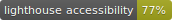

# Storyscript Dashboard

[](http://commitizen.github.io/cz-cli/)
[](https://app.netlify.com/sites/musing-nobel-a05d19/deploys)
[](https://circleci.com/gh/storyscript/dashboard)
[](https://codecov.io/gh/storyscript/dashboard)
[](https://dashboard.storyscript.io)

## Project commands

```bash
$> yarn install   # Install dependencies
$> yarn serve     # Start a dev server with HMR
$> yarn build     # Build for production
$> yarn test      # Run tests with coverage
$> yarn commit    # Commit using commitizen
$> yarn release   # Bump version and generates CHANGELOG.md
```

## Start development stack

> Requirements:
>
> - Binding authorisation (on macOS) + directories `/docker-host/storyscript/(postgres|pgadmin)`
> - Docker and Docker Compose (>`18.06.0+`)

> The first time

```bash
$> docker-compose up -d database

$> git clone git@github.com:storyscript/database.git

$> cd database    # Edit the Makefile to add args to the reset command
                  # e.g.: psql -h localhost -U postgres ${DB} ...

$> make reset

$> docker-compose up -d
```

You can now access:

- **traefik** at [`docker.localhost:8081`](http://docker.localhost:8081)
- **postgres** at `pg.docker.localhost:5432` (or `database:5432` inside the docker stack)
- **pgadmin** at [`pgadmin.docker.localhost`](http://pgadmin.docker.localhost)
- **platform-graphql** at `graphql.docker.localhost` and [`graphql.docker.localhost/graphiql`](http://`graphql.docker.localhost/graphiql`)

> The other times

```bash
$> docker-compose down    # Stop all the containers and remove them
                          # Since the data is bound to the host,
                          # you'll keep your data

$> docker-compose stop    # Stop the containers

$> docker-compose up -d   # Start all the containers in the right order
```

## Lighthouse Score

[](https://github.com/GoogleChrome/lighthouse)

[](https://dashboard.storyscript.io)
[](https://dashboard.storyscript.io)
[](https://dashboard.storyscript.io)
[](https://dashboard.storyscript.io)
[](https://dashboard.storyscript.io)
